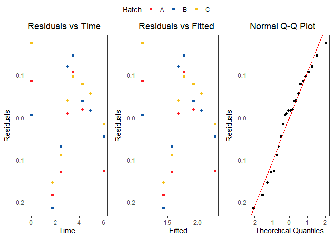

<!-- README.md is generated from README.Rmd. Please edit that file -->

# stability

<!-- badges: start -->
<!-- badges: end -->

The goal of stability is to analyse stability data to determine product
expiry date based on pre-defined upper/lower limits in the drug
development process. Observed stability results and expiry date based on
the chosen stability model are visualised by time (months) and batch.

## Installation

You can install the development version of stability from
[GitHub](https://github.com/) with:

``` r
# install.packages("pak")
pak::pak("joanna-ling/stability")
```

## Example

This is a basic example which shows you how to solve a common problem:

``` r
#### Load Required Packages ####
if (!require("pacman")) install.packages("pacman")
#> Loading required package: pacman
#> Warning: package 'pacman' was built under R version 4.3.2

suppressMessages(
  pacman::p_load(
    tidyverse,
    ggplot2,
    readxl,
    janitor,
    stringr,
    ggpubr,
    stability
  )
)

data(example_data)

# Test using CSL312 sFP 36 months example data
data <- example_data %>% 
  clean_names() %>% 
  mutate(time = time_months,
         batch = lot) %>% 
  subset(!(temperature == "2 to 8°C" & time == 36)) %>% 
  # This part is manually removing values that are different from the report... 
  mutate(flag = case_when(quality_attribute == "SE HPLC Monomer" & result_value == 97.2 & time == 3 & batch == "P100213605" ~ 1,
                          quality_attribute == "SE HPLC Monomer" & result_value == 97.5 & time == 3 & batch == "P100229828" ~ 1,
                          quality_attribute == "SE HPLC Monomer" & result_value == 97.5 & time == 9 & batch == "P100229828" ~ 1,
                          quality_attribute == "SE HPLC HMWS" & result_value == 3.0 & time == 3 & batch == "P100213605" ~ 1,
                          quality_attribute == "SE HPLC HMWS" & result_value == 2.1 & time == 3 & batch == "P100229828" ~ 1,
                          quality_attribute == "SE HPLC HMWS" & result_value == 2.5 & time == 9 & batch == "P100229828" ~ 1,
                          TRUE ~ 0 )) %>% 
  subset(flag == 0)

data_dist <- data[,c("quality_attribute","units","lower_limit","upper_limit")] %>% 
  distinct() %>% 
  subset(!is.na(lower_limit) | !is.na(upper_limit)) %>% 
  mutate(label = case_when(units == "N/A" ~ paste0(quality_attribute),
                           TRUE ~ paste0(quality_attribute," (",units,")")))

data_transf <- data %>% 
  mutate(time = case_when(quality_attribute == "SE HPLC Monomer" ~ sqrt(time),
                          quality_attribute == "SE HPLC HMWS" ~ sqrt(time),
                          quality_attribute == "CE reducing" ~ sqrt(time),
                          quality_attribute == "CE non reducing LMWS" ~ sqrt(time),
                          TRUE ~ time),
         backtransform = case_when(quality_attribute == "SE HPLC Monomer" ~ "Time^2",
                                   quality_attribute == "SE HPLC HMWS" ~ "Time^2",
                                   quality_attribute == "CE reducing" ~ "Time^2",
                                   quality_attribute == "CE non reducing LMWS" ~ "Time^2",
                                   TRUE ~ "Time"))

# Set colours using all batches in dataset
colours <- c("#FC1921","#0E56A5","#F5C017","#975DA2","#00A28A",
             "#DA2877","#F06125","#03B3BE","#C6D92D","#572A7B")
colours_named <- setNames(object = colours, nm = c(unique(data_transf$batch),"Common Intercept"))

qa <- data_dist$quality_attribute
lbl <- data_dist$label
ll <- data_dist$lower_limit
ul <- data_dist$upper_limit

# Initialise empty results list 
stab <- vector(mode = "list", length = length(qa))

# Loop over all quality attributes and save results to list
for (i in 1:length(qa)) {
  
  data_qa <- subset(data_transf, quality_attribute == qa[i])
  
  bt <- unique(data_qa$backtransform)
  
  stab[[i]] <- stability(data = data_qa, outcome = "result_value", label = lbl[i],
                         lowerlimit = ll[i], upperlimit = ul[i], poolMSE = 0, 
                         backtransform = bt, colours_named = colours_named, debug = 0)
  
}

# The results are returned in a list containing: 
#   1. The chosen model as a number
#   2. The chosen model as a string 
#   3. A tibble of the estimated expiry dates and model fit with 90/95% confidence intervals for each model and batch
#   4. A tibble of the parameter estimates, standard errors, t value and p-value for each model 
#   5. The estimated expiry date from the chosen model as a number
#   6. The plot of observed stability data and predicted model fit with the appropriate confidence intervals up till the expiry date
#   7. A list of residual plots for models 1 to 4. 

stab[[1]]
#> [[1]]
#> [1] 3
#> 
#> [[2]]
#> [1] "Common intercepts and Common slopes"
#> 
#> [[3]]
#> # A tibble: 11 × 15
#> # Groups:   model, batch, flag [11]
#>    batch     time   fit lwr90 upr90 lwr95 upr95 model diff_lwr flag_lwr diff_upr
#>    <chr>    <dbl> <dbl> <dbl> <dbl> <dbl> <dbl> <dbl>    <dbl>    <dbl>    <dbl>
#>  1 P100213…  78.6  5.89  5.73  6.05  5.70  6.08     1  1.58e-7        1  2.15e-1
#>  2 P100229…  71.7  5.87  5.73  6.01  5.70  6.04     1  1.28e-6        1  2.56e-1
#>  3 P100269…  74.0  5.88  5.73  6.03  5.70  6.06     1  1.48e-6        1  2.42e-1
#>  4 P100213… 105.   5.85  5.73  5.98  5.70  6.00     2  1.86e-6        1  2.98e-1
#>  5 P100229…  97.8  5.84  5.72  5.96  5.70  5.98     2  2.65e-6        1  3.20e-1
#>  6 P100269…  92.0  5.83  5.72  5.94  5.70  5.96     2  3.01e-6        1  3.38e-1
#>  7 0         98.4  5.84  5.72  5.96  5.70  5.98     3  1.82e-6        1  3.20e-1
#>  8 P100213…  71.4  5.91  5.74  6.07  5.70  6.11     4  1.16e-6        1  1.89e-1
#>  9 P100213… 178.   5.71  5.25  6.18  5.13  6.30     4 -5.71e-1        1  3.01e-7
#> 10 P100229…  64.6  5.89  5.74  6.04  5.70  6.07     4  1.79e-6        1  2.27e-1
#> 11 P100269…  75.5  5.88  5.74  6.02  5.70  6.05     4  9.61e-7        1  2.47e-1
#> # ℹ 4 more variables: flag_upr <dbl>, flag <chr>, rn <int>, level <dbl>
#> 
#> [[4]]
#> # A tibble: 18 × 6
#>    model parameter             Estimate `Std. Error` `t value` `Pr(>|t|)`
#>    <dbl> <chr>                    <dbl>        <dbl>     <dbl>      <dbl>
#>  1     1 Intercept: P100213605  6.03        0.0290      208.     2.70e-36
#>  2     1 Slope: P100213605     -0.00179     0.00145      -1.24   2.28e- 1
#>  3     1 Intercept: P100229828  6.01        0.0290      207.     2.90e-36
#>  4     1 Slope: P100229828     -0.00197     0.00145      -1.37   1.86e- 1
#>  5     1 Intercept: P100269008  5.99        0.0290      206.     3.19e-36
#>  6     1 Slope: P100269008     -0.00145     0.00145      -1.00   3.27e- 1
#>  7     2 Slope                 -0.00174     0.000799     -2.18   3.99e- 2
#>  8     2 Intercept: P100213605  6.03        0.0213      284.     2.89e-42
#>  9     2 Intercept: P100229828  6.01        0.0213      283.     3.15e-42
#> 10     2 Intercept: P100269008  5.99        0.0213      282.     3.39e-42
#> 11     3 Slope                 -0.00174     0.000814     -2.14   4.27e- 2
#> 12     3 Intercept              6.01        0.0163      368.     3.35e-48
#> 13     4 Slope: P100213605     -0.00179     0.00152      -1.18   2.78e- 1
#> 14     4 Intercept: P100213605  6.03        0.0306      197.     2.26e-14
#> 15     4 Slope: P100229828     -0.00197     0.00156      -1.26   2.47e- 1
#> 16     4 Intercept: P100229828  6.01        0.0314      192.     2.77e-14
#> 17     4 Slope: P100269008     -0.00145     0.00122      -1.18   2.75e- 1
#> 18     4 Intercept: P100269008  5.99        0.0246      244.     5.17e-15
#> 
#> [[5]]
#> [1] 98.382
#> 
#> [[6]]
```


    #> 
    #> [[7]]
    #> [[7]][[1]]


    #> 
    #> [[7]][[2]]


    #> 
    #> [[7]][[3]]



    #> 
    #> [[7]][[4]]


