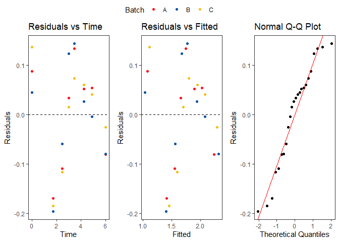

<!-- README.md is generated from README.Rmd. Please edit that file -->

# stability

<!-- badges: start -->
<!-- badges: end -->

The goal of stability is to analyse stability data to determine product
expiry date based on pre-defined upper/lower limits in the drug
development process. Observed stability results and expiry date based on
the chosen stability model are visualised by time (months) and batch.

## Installation

You can install the development version of stability from
[GitHub](https://github.com/) with:

``` r
# install.packages("pak")
pak::pak("joanna-ling/stability")
```

## Example

This is a basic example which shows you how to solve a common problem:

``` r

# pak::pak("joanna-ling/stability")

#### Load Required Packages ####
if (!require("pacman")) install.packages("pacman")
#> Loading required package: pacman

suppressMessages(
  pacman::p_load(
    tidyverse,
    ggplot2,
    readxl,
    janitor,
    stringr,
    ggpubr,
    stability
  )
)

# Generate example data for a stability study
set.seed(873951)
example_data <- tibble(quality_attribute = c("SE HPLC HMWS", "pH", "CE Reducing Main Peak")) %>% 
  cross_join(tibble(time_months = c(0, 3, 6, 9, 12, 18, 24, 36))) %>%
  cross_join(tibble(batch = c("A", "B", "C"))) %>% 
  mutate(result_value = case_when(quality_attribute == "pH" ~ round(runif(n(), min = 5.9, max = 6.1),2),
                           quality_attribute == "SE HPLC HMWS" & time_months == 0 ~ round(rnorm(n(), mean = 1.2, sd = 0.05),2),
                           quality_attribute == "SE HPLC HMWS" & time_months == 3 ~ round(rnorm(n(), mean = 1.3, sd = 0.05),2),
                           quality_attribute == "SE HPLC HMWS" & time_months == 6 ~ round(rnorm(n(), mean = 1.5, sd = 0.05),2),
                           quality_attribute == "SE HPLC HMWS" & time_months == 9 ~ round(rnorm(n(), mean = 1.7, sd = 0.05),2),
                           quality_attribute == "SE HPLC HMWS" & time_months == 12 ~ round(rnorm(n(), mean = 1.9, sd = 0.05),2),
                           quality_attribute == "SE HPLC HMWS" & time_months == 18 ~ round(rnorm(n(), mean = 2, sd = 0.05),2),
                           quality_attribute == "SE HPLC HMWS" & time_months == 24 ~ round(rnorm(n(), mean = 2.1, sd = 0.05),2),
                           quality_attribute == "SE HPLC HMWS" & time_months == 36 ~ round(rnorm(n(), mean = 2.2, sd = 0.05),2),
                           quality_attribute == "CE Reducing Main Peak" & time_months == 0 ~ round(rnorm(n(), mean = 97, sd = 0.07),2),
                           quality_attribute == "CE Reducing Main Peak" & time_months == 3 ~ round(rnorm(n(), mean = 96.8, sd = 0.07),2),
                           quality_attribute == "CE Reducing Main Peak" & time_months == 6 ~ round(rnorm(n(), mean = 96.6, sd = 0.07),2),
                           quality_attribute == "CE Reducing Main Peak" & time_months == 9 ~ round(rnorm(n(), mean = 96.4, sd = 0.07),2),
                           quality_attribute == "CE Reducing Main Peak" & time_months == 12 ~ round(rnorm(n(), mean = 96.3, sd = 0.07),2),
                           quality_attribute == "CE Reducing Main Peak" & time_months == 18 ~ round(rnorm(n(), mean = 96.2, sd = 0.07),2),
                           quality_attribute == "CE Reducing Main Peak" & time_months == 24 ~ round(rnorm(n(), mean = 96.1, sd = 0.07),2),
                           quality_attribute == "CE Reducing Main Peak" & time_months == 36 ~ round(rnorm(n(), mean = 96.0, sd = 0.07),2),
                           TRUE ~ NA),
         lower_limit = case_when(quality_attribute == "pH" ~ 5.8,
                                 quality_attribute == "CE Reducing Main Peak" ~ 94.5,
                                 TRUE ~ NA),
         upper_limit = case_when(quality_attribute == "pH" ~ 6.2,
                                 quality_attribute == "SE HPLC HMWS" ~ 4.3,
                                 TRUE ~ NA),
         units = case_when(quality_attribute == "pH" ~ "",
                           quality_attribute == "SE HPLC HMWS" ~ "%",
                           quality_attribute == "CE Reducing Main Peak" ~ "%",
                           TRUE ~ NA),
         label = case_when(quality_attribute == "pH" ~ "pH",
                          TRUE ~ paste0(quality_attribute, " (", units, ")")),
         time = time_months)


# Get a dataset of distinct limits and generate clean labels 
data_dist <- example_data[,c("quality_attribute","units","label","lower_limit","upper_limit")] %>% 
  distinct() %>% 
  subset(!is.na(lower_limit) | !is.na(upper_limit)) 

# Transform time variable where needed and generate back transform variable - trial and error
data_transf <- example_data %>% 
  mutate(time = case_when(quality_attribute == "SE HPLC HMWS" ~ time^(1/2),
                          quality_attribute == "CE Reducing Main Peak" ~ time^(1/3),
                          TRUE ~ time),
         backtransform = case_when(quality_attribute == "SE HPLC HMWS" ~ "Time^2",
                                   quality_attribute == "CE Reducing Main Peak" ~ "Time^3",
                                   TRUE ~ "Time"))

# Set colours using all batches in dataset
colours <- c("#FC1921","#0E56A5","#F5C017","#975DA2","#00A28A",
             "#DA2877","#F06125","#03B3BE","#C6D92D","#572A7B")
colours_named <- setNames(object = colours, nm = c(unique(data_transf$batch),"Common Intercept"))

# Get vectors of quality attributes, labels and limits
qa <- data_dist$quality_attribute
lbl <- data_dist$label
ll <- data_dist$lower_limit
ul <- data_dist$upper_limit

# Initialise empty results list 
stab <- vector(mode = "list", length = length(qa))

# Loop over all quality attributes and save results to list
for (i in 1:length(qa)) {
  
  # Subset selected quality attribute
  data_qa <- subset(data_transf, quality_attribute == qa[i])
  
  # Get backtransformation string for the selected attribute
  bt <- unique(data_qa$backtransform)
  
  # Run stability function and save results to list
  stab[[i]] <- stability(data = data_qa, outcome = "result_value", label = lbl[i],
                         lowerlimit = ll[i], upperlimit = ul[i], poolMSE = 0, 
                         backtransform = bt, colours_named = colours_named, debug = 0)
  
}

# The results returned in the list contain: 
#   1. The chosen model as a number
#   2. The chosen model as a string 
#   3. A tibble of the estimated expiry dates and model fit with 90/95% confidence intervals for each model and batch
#   4. A tibble of the parameter estimates, standard errors, t value and p-value for each model 
#   5. The estimated expiry date from the chosen model as a number
#   6. The plot of observed stability data and predicted model fit with the appropriate confidence intervals up till the expiry date
#   7. A list of residual plots for models 1 to 4. 

stab[[1]]
#> [[1]]
#> [1] 3
#> 
#> [[2]]
#> [1] "Common intercepts and Common slopes"
#> 
#> [[3]]
#> # A tibble: 10 × 12
#> # Groups:   model, batch, flag [10]
#>    batch  time   fit lwr90 upr90 lwr95 upr95 model       diff  flag    rn level
#>    <chr> <dbl> <dbl> <dbl> <dbl> <dbl> <dbl> <dbl>      <dbl> <dbl> <int> <dbl>
#>  1 A      14.3  3.85  3.40  4.30  3.30  4.40     1 0.000214       1     1    90
#>  2 B      13.3  3.89  3.47  4.30  3.38  4.39     1 0.000188       1     1    90
#>  3 C      13.9  3.86  3.42  4.30  3.33  4.39     1 0.0000733      1     1    90
#>  4 A      14.8  4.03  3.77  4.30  3.71  4.36     2 0.0000552      1     1    90
#>  5 B      14.7  4.04  3.77  4.30  3.72  4.36     2 0.0000830      1     1    90
#>  6 C      14.6  4.04  3.78  4.30  3.72  4.35     2 0.0000186      1     1    90
#>  7 0      14.7  4.05  3.80  4.30  3.75  4.35     3 0.000156       1     1    90
#>  8 A      14.1  3.81  3.32  4.30  3.19  4.43     4 0.000188       1     1    90
#>  9 B      13.1  3.83  3.36  4.30  3.24  4.42     4 0.000121       1     1    90
#> 10 C      13.8  3.83  3.35  4.30  3.23  4.42     4 0.00000499     1     1    90
#> 
#> [[4]]
#> # A tibble: 18 × 6
#>    model parameter    Estimate `Std. Error` `t value` `Pr(>|t|)`
#>    <dbl> <chr>           <dbl>        <dbl>     <dbl>      <dbl>
#>  1     1 Intercept: A    1.07        0.0857     12.5    2.58e-10
#>  2     1 Slope: A        0.195       0.0233      8.34   1.35e- 7
#>  3     1 Intercept: B    1.03        0.0857     12.1    4.60e-10
#>  4     1 Slope: B        0.214       0.0233      9.17   3.31e- 8
#>  5     1 Intercept: C    1.11        0.0857     13.0    1.40e-10
#>  6     1 Slope: C        0.197       0.0233      8.44   1.13e- 7
#>  7     2 Slope           0.202       0.0129     15.6    1.14e-12
#>  8     2 Intercept: A    1.05        0.0574     18.3    5.99e-14
#>  9     2 Intercept: B    1.07        0.0574     18.7    3.84e-14
#> 10     2 Intercept: C    1.10        0.0574     19.1    2.53e-14
#> 11     3 Slope           0.202       0.0126     16.1    1.21e-13
#> 12     3 Intercept       1.07        0.0461     23.3    5.51e-17
#> 13     4 Slope: A        0.195       0.0230      8.45   1.50e- 4
#> 14     4 Intercept: A    1.07        0.0847     12.7    1.48e- 5
#> 15     4 Slope: B        0.214       0.0241      8.89   1.13e- 4
#> 16     4 Intercept: B    1.03        0.0885     11.7    2.36e- 5
#> 17     4 Slope: C        0.197       0.0229      8.62   1.34e- 4
#> 18     4 Intercept: C    1.11        0.0840     13.3    1.14e- 5
#> 
#> [[5]]
#> [1] 180
#> 
#> [[6]]
```


    #> 
    #> [[7]]
    #> [[7]][[1]]


    #> 
    #> [[7]][[2]]


    #> 
    #> [[7]][[3]]


    #> 
    #> [[7]][[4]]


